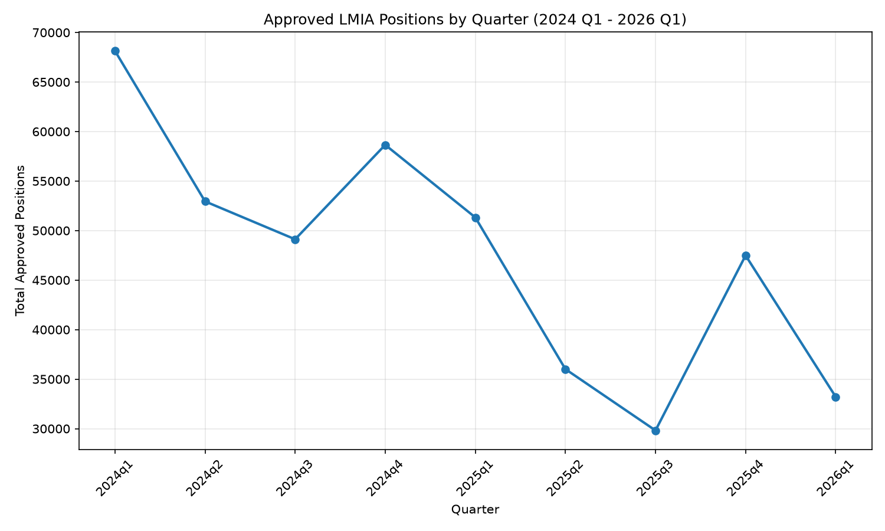
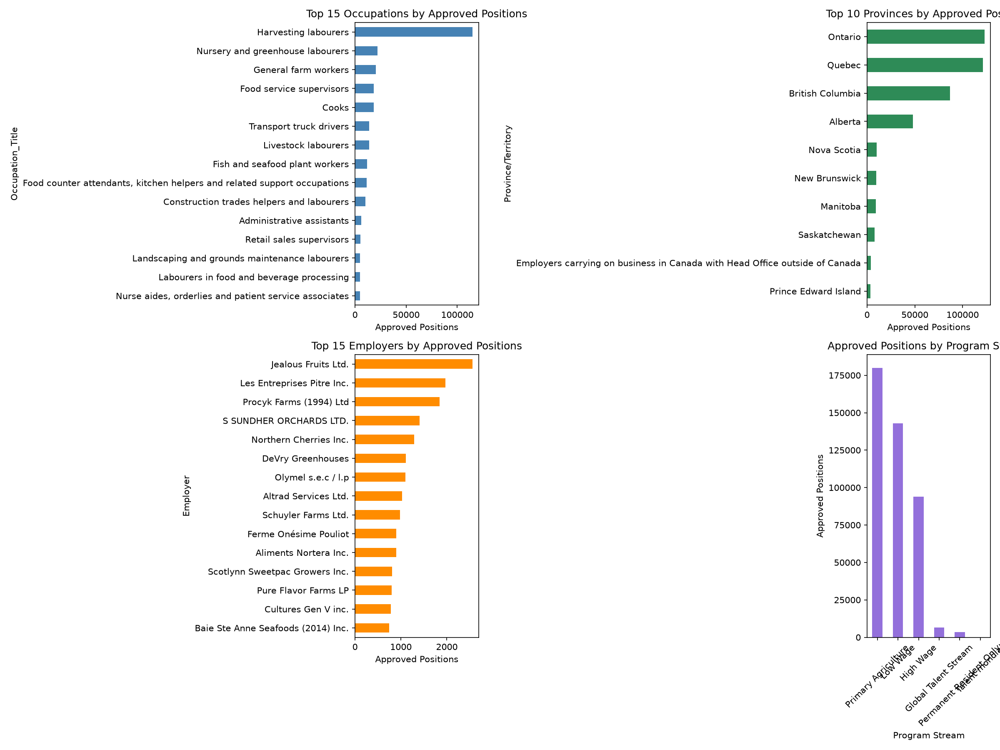
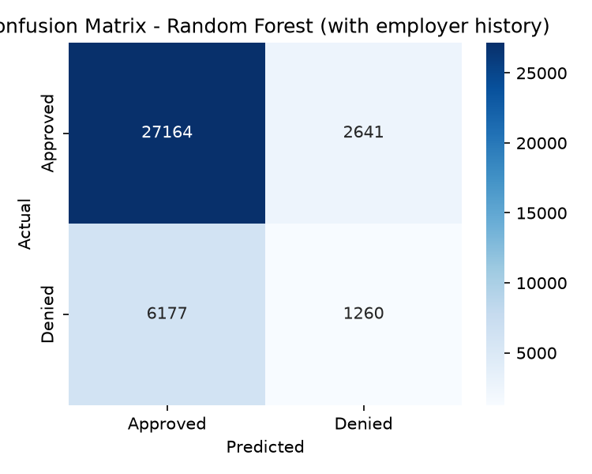

# Canada LMIA Labour Market Analysis

Analysis of Canada's Temporary Foreign Worker Program (TFWP) using real government disclosure data, tracking approval trends, occupation and sector breakdowns, and building a machine learning model to predict LMIA approval outcomes.

## The Data

This project uses official [Employment and Social Development Canada (ESDC)](https://open.canada.ca/data/en/dataset/90fed587-1364-4f33-a9ee-208181dc0b97) disclosure data, the same public transparency releases the government publishes quarterly on employers who received a Labour Market Impact Assessment (LMIA) decision.

- **9 quarters** combined: 2024 Q1 through 2026 Q1
- **150,288** positive (approved) LMIA records
- **16,877** negative (denied) LMIA records
- **167,165** total labeled records after cleaning

This is real, messy government data, not a cleaned Kaggle dataset. Cleaning involved: stripping footer/disclaimer text rows embedded in the Excel files, extracting occupation (NOC) codes from combined text fields (e.g. `"2173-Software engineers and designers"`), and handling a mid-2024 change in Canada's occupation classification system (NOC 2011 → NOC 2021).

## Key Findings

### 1. The program has shrunk by over half in two years
Total approved TFW positions fell from **68,148 in Q1 2024 to 33,216 in Q1 2026, a 51.3% decline.** The number of unique employers using the program dropped even more sharply, from 20,923 to 7,884 (62%). This reflects real, deliberate tightening of Canada's Temporary Foreign Worker Program policy over this period.



Interestingly, both 2024 Q4 and 2025 Q4 show a temporary uptick before continuing to decline, a possible seasonal hiring pattern worth further investigation.

### 2. The program is overwhelmingly agricultural, not tech
Contrary to common assumptions about foreign worker programs, this data is dominated by seasonal and manual labour:

- **Primary Agriculture** stream: 179,815 positions (largest single category)
- **Harvesting labourers** alone: 115,076 positions, more than the next 5 occupations combined
- **Global Talent Stream** (the skilled-tech-focused stream): only 6,606 positions

Even within the "High Wage" + "Global Talent" skilled streams, trades occupations (truck drivers, carpenters, welders) outnumber tech roles.



### 3. A real, isolatable tech sector exists, concentrated in Ontario and Quebec
Filtering to NOC 21xxx (professional science/tech occupations) reveals a genuine, if small, tech hiring pattern:

- **8,940 total positions** (2.1% of all approved positions)
- Led by **Software engineers and designers** (1,785) and **Software developers and programmers** (1,302)
- A clear "data" cluster: **Data scientists** (247), **Database analysts** (442)
- **Ontario (3,376) and Quebec (3,261)** are nearly tied for the top spot, not the Ontario-dominant pattern most would expect

### 4. Predicting approval/denial reveals a real distribution shift
Using province, program stream, broad occupation category, and employer historical denial rate as features, I trained a classifier (Logistic Regression and Random Forest) to predict LMIA approval outcomes, using a **time-based split** (train on 2024 Q1 - 2025 Q2, test on 2025 Q3 - 2026 Q1) to properly simulate real-world deployment rather than a random split.

| | Precision (Denied) | Recall (Denied) | Overall Accuracy |
|---|---|---|---|
| Logistic Regression | 0.39 | 0.09 | 0.79 |
| Random Forest | 0.32 | 0.17 | 0.76 |

**The real finding here isn't the accuracy number, it's why the model underperforms.** The denial rate itself nearly **tripled** between the training period (7.3%) and the test period (20.0%), a direct consequence of the same program-tightening trend found in Finding #1. This is a textbook case of *distribution shift*: a model trained on one policy environment struggles when that environment changes significantly by the time it's deployed. It also reinforces that public LMIA data captures location/occupation/stream, but not the employer-specific factors (application quality, compliance history) that likely drive real denial decisions.



## Tech Stack

- **Python**, pandas, scikit-learn, matplotlib, seaborn
- **Data**: Government of Canada Open Data (ESDC TFWP disclosure files, 9 quarters, positive + negative LMIA lists)
- Time-based train/test validation (not random split) to properly test temporal generalization

## Project Structure

```
canada-lmia-salary-predictor/
├── data/                     # Raw XLSX files (gitignored) + cleaned CSVs (gitignored, regenerate via scripts)
├── notebooks/                # Generated charts
├── src/
│   ├── explore.py            # Initial structure inspection
│   ├── explore_negative.py   # Negative LMIA file structure check
│   ├── clean.py              # Cleans and combines positive LMIA files
│   ├── clean_all.py          # Combines positive + negative into labeled dataset
│   ├── analyze_trend.py      # Quarterly trend analysis
│   ├── analyze_top.py        # Occupation/province/employer/sector breakdowns
│   └── train_classifier.py   # Approval/denial classification model
└── README.md
```

## Reproducing This

1. Download the positive and negative LMIA employer list quarterly files (2024 Q1 - 2026 Q1) from ESDC's Open Data portal, [positive list](https://open.canada.ca/data/en/dataset/90fed587-1364-4f33-a9ee-208181dc0b97), [negative list](https://open.canada.ca/data/en/dataset/f82f66f2-a22b-4511-bccf-e1d74db39ae5), English XLSX files, named `tfwp_YYYYqN_pos_en.xlsx` / `tfwp_YYYYqN_neg_en.xlsx`, into a `data/` folder.
2. `pip install pandas openpyxl matplotlib seaborn scikit-learn`
3. Run scripts in order: `clean.py` → `clean_all.py` → `analyze_trend.py` → `analyze_top.py` → `train_classifier.py`

## Limitations & Future Work

- This dataset only covers LMIA *decisions*, not actual work permits issued (IRCC handles that separately)
- No wage data is included in this dataset; a natural extension would be joining Job Bank's public wage report data by occupation/province to add salary prediction
- The classifier's features are all macro-level; adding employer size, application history depth, or NAICS industry codes could improve predictive power
- Employer name matching isn't deduplicated (e.g. minor name variations for the same company may be treated as distinct)